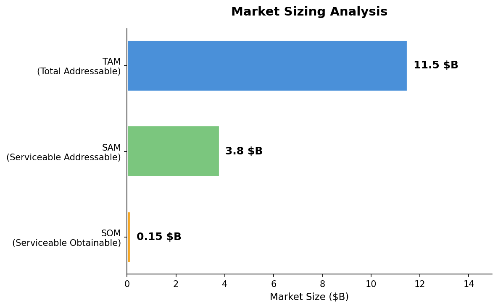
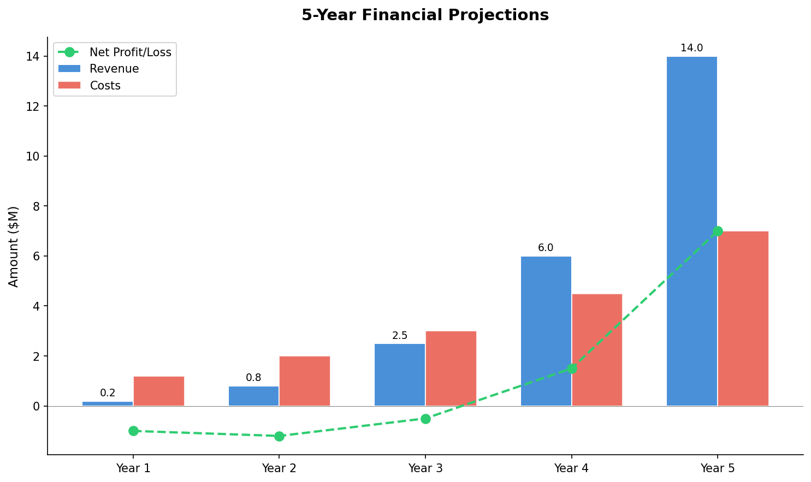
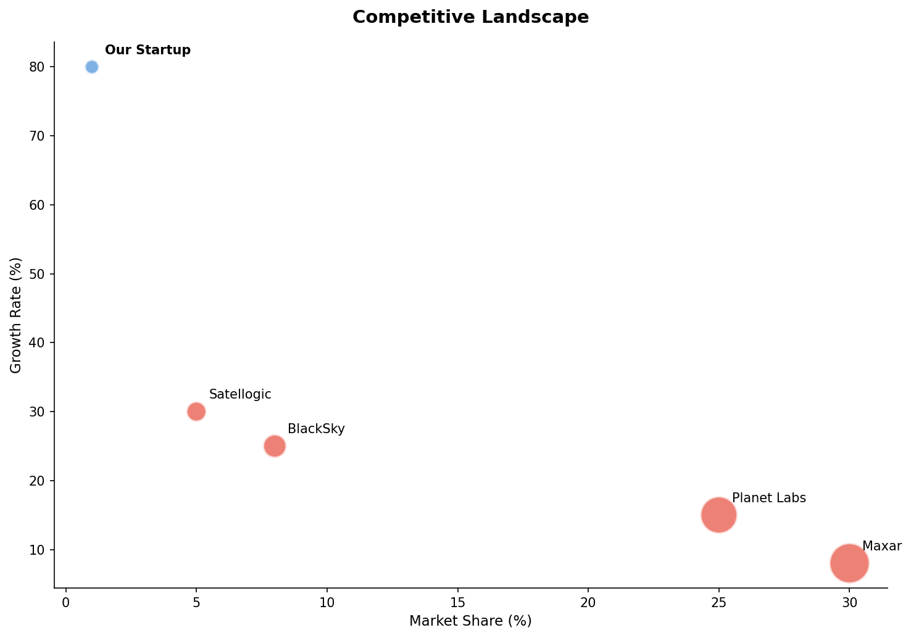
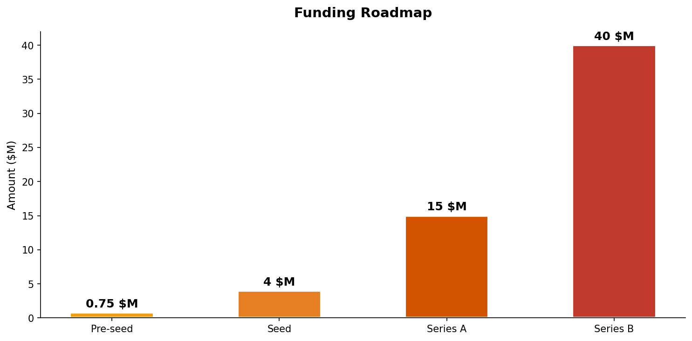

# Satellite Imagery Startup Plan

*Generated by LangGraph Parallel Planning Pipeline*

---

📋 **Chief Strategy Officer — Report Synthesizer**

# 🚀 STARTUP PLAN: GeoAI Insights

## Executive Summary
GeoAI Insights is an AI-powered satellite imagery analytics startup offering actionable insights for agriculture, urban planning, and environmental monitoring. Through an API-first approach and a user-friendly dashboard, we enable customers to monitor crop health, detect deforestation, track urban expansion, and identify anomalies such as illegal mining. With a SaaS subscription model, we aim to capture a growing share of the $1.5 billion addressable market. Backed by advancements in AI, cloud-native platforms, and small satellite constellations, GeoAI Insights is poised to deliver affordable, scalable solutions to underserved segments. We seek $500K in pre-seed funding to build our MVP and secure initial customers.

---

## 1. Market Opportunity
### Market Size
- **TAM**: $4.2 billion in 2023, growing rapidly due to AI and satellite advancements.
- **SAM**: $1.5 billion focused on agriculture, urban planning, and environmental monitoring.
- **SOM**: $50 million in Year 1-2, targeting a 3% penetration of the SAM.

### Key Trends
1. Rising adoption of AI-powered geospatial analytics for anomaly detection and actionable insights.
2. Deployment of small satellite constellations enabling high-frequency imaging.
3. Shift to cloud-native platforms for real-time data processing and integration.

### Target Customer Segments
1. **Agricultural Enterprises**: High willingness to pay for crop health monitoring and yield optimization.
2. **Government Agencies**: Strong demand for real-time data for policy-making and disaster response.
3. **Insurance Companies**: Moderate demand for risk assessments and damage evaluations.
4. **Environmental NGOs**: Lower budgets but high need for cost-effective monitoring tools.

### Market Timing Rationale
The convergence of AI, cloud computing, and small satellite technology, coupled with regulatory pressures and climate change concerns, makes this the ideal time to launch GeoAI Insights.

---

## 2. Competitive Landscape
### Competitor Overview

| Company            | Type         | Est. Revenue | Market Share | Key Strength                          |
|---------------------|--------------|--------------|--------------|---------------------------------------|
| Planet Labs        | Direct       | $282M        | ~30%         | Large satellite constellation, daily imaging |
| Maxar Technologies | Direct       | ~$500M       | ~35%         | High-resolution imagery, 3D data, geospatial analytics |
| BlackSky Global    | Direct       | ~$50M        | ~5%          | Rapid revisit rates, real-time updates |
| EOS Data Analytics | Adjacent     | ~$10M (est.) | ~2%          | AI-powered analytics for agriculture and forestry |

### Key Insight: Competitor Weaknesses
- High costs and limited focus on underserved segments like small agricultural enterprises and NGOs.
- Lack of simplified API integration and real-time anomaly detection across competitors.

### Differentiation Strategy
- Affordable SaaS pricing tiers targeting smaller enterprises and NGOs.
- Intuitive dashboard with push notifications for real-time alerts.
- Flexible API integration for non-technical users.

### Competitive Moat
- Proprietary AI models for anomaly detection and change monitoring.
- Focused customer acquisition strategy targeting underserved segments.
- Scalable cloud-native infrastructure for real-time analytics.

---

## 3. Financial Plan
### Revenue Model
- **Starter**: $499/month (100 sq km coverage).
- **Pro**: $1,999/month (1,000 sq km coverage).
- **Enterprise**: $4,999/month (unlimited coverage with custom SLA).

### 5-Year Projection Highlights
| Metric      | Year 1 | Year 2 | Year 3 | Year 4 | Year 5 |
|-------------|--------|--------|--------|--------|--------|
| Revenue     | $1.2M  | $5.4M  | $12M   | $21M   | $36M   |
| Costs       | $1.74M | $2.1M  | $3M    | $4.2M  | $5.5M  |
| Net Profit  | -$0.54M| $3.3M  | $9M    | $16.8M | $30.5M |

### Unit Economics
- **CAC**: $8,500.
- **LTV**: $72,000.
- **LTV/CAC Ratio**: 8.5.
- **Payback Period**: 4 months.
- **Gross Margin**: 70%.

### Breakeven Timeline
- **Monthly Breakeven**: $145,133 MRR (~30 customers).
- **Expected Breakeven**: Month 9.

### Key Financial Risks
- High upfront infrastructure costs.
- Slower-than-expected customer acquisition due to competition.

---

## 4. Funding Strategy
### Recommended Fundraising Path
1. **Pre-seed**: $500K–$1M to build MVP and secure initial customers.
2. **Seed**: $2.5M–$5M to scale customer acquisition and refine product.
3. **Series A**: $10M–$15M to achieve $1M ARR and expand partnerships.

### Target Investors
1. ValueStream Ventures.
2. 8VC.
3. Space Capital.
4. Orbital Edge Accelerator.
5. St. Louis Geospatial Technology Accelerator.

### Total Capital Needed Over 3 Years
$18M across Pre-seed, Seed, and Series A rounds.

---

## 5. Go-to-Market Strategy
### Launch Strategy (First 90 Days)
- Build MVP with core features: API integration, dashboard, and AI-powered anomaly detection.
- Secure 5 pilot customers (agriculture and NGOs).
- Attend industry conferences to showcase product.

### Customer Acquisition Channels
1. Digital marketing (SEO, paid ads targeting agriculture and urban planning).
2. Partnerships with agricultural equipment manufacturers.
3. Direct outreach to NGOs and government agencies.

### Pricing Strategy Rationale
- Affordable tiers to attract small enterprises and NGOs.
- Enterprise pricing for high-value customers requiring custom SLAs.

### Partnership Opportunities
- Collaborate with satellite providers like Planet Labs for imagery access.
- Partner with agricultural equipment manufacturers for bundled offerings.

---

## 6. Risk Matrix

| Risk                        | Probability | Impact | Mitigation                          |
|-----------------------------|-------------|--------|-------------------------------------|
| High competition            | High        | High   | Focus on underserved segments and affordability. |
| Regulatory compliance issues| Medium      | High   | Invest in legal expertise for GDPR and PHMSA compliance. |
| Slow customer acquisition   | Medium      | High   | Aggressive marketing and partnerships. |
| Infrastructure cost overruns| Medium      | Medium | Optimize cloud usage and negotiate vendor contracts. |

---

## 7. 90-Day Action Plan

| Week | Action Items                          | Owner         | Success Metric                 |
|------|---------------------------------------|---------------|--------------------------------|
| 1-2  | Finalize MVP design and development  | CTO           | MVP ready for pilot testing.  |
| 3-4  | Secure 5 pilot customers             | CEO           | 5 signed contracts.           |
| 5-8  | Launch marketing campaigns           | CMO           | 1,000 leads generated.        |
| 9-12 | Attend industry conferences          | CEO + CMO     | 3 partnership discussions.    |

---

## 8. Key Metrics Dashboard
1. Monthly Recurring Revenue (MRR).
2. Customer Acquisition Cost (CAC).
3. Lifetime Value (LTV).
4. Customer Retention Rate.
5. Active Users (API calls and dashboard usage).

---

## CHART_DATA
```json
{
  "market_size": {
    "tam": 4.2,
    "sam": 1.5,
    "som": 0.05,
    "unit": "$B"
  },
  "competitors": {
    "names": ["Planet Labs", "Maxar Technologies", "BlackSky Global", "Our Startup"],
    "market_share": [30, 35, 5, 2],
    "growth_rate": [32.6, 8, 15, 50]
  },
  "financial_projections": {
    "years": [1, 2, 3, 4, 5],
    "revenue": [1.2, 5.4, 12, 21, 36],
    "costs": [1.74, 2.1, 3, 4.2, 5.5],
    "unit": "$M"
  },
  "funding": {
    "rounds": ["Pre-seed", "Seed", "Series A", "Series B"],
    "amounts": [0.5, 2.5, 10, 30],
    "unit": "$M"
  }
}
```

---
### 📈 Generated Charts
- **Market Size**: `/Users/soumendusekharbhattacharjee/Documents/DATA-SCIENCE/Langgraph_Skills_MCP/outputs/market_size.png`
- **Financial Projections**: `/Users/soumendusekharbhattacharjee/Documents/DATA-SCIENCE/Langgraph_Skills_MCP/outputs/financial_projections.png`
- **Competitors**: `/Users/soumendusekharbhattacharjee/Documents/DATA-SCIENCE/Langgraph_Skills_MCP/outputs/competitor_landscape.png`
- **Funding**: `/Users/soumendusekharbhattacharjee/Documents/DATA-SCIENCE/Langgraph_Skills_MCP/outputs/funding_timeline.png`


---
## Generated Charts

### Market Size


### Financial Projections


### Competitors


### Funding


